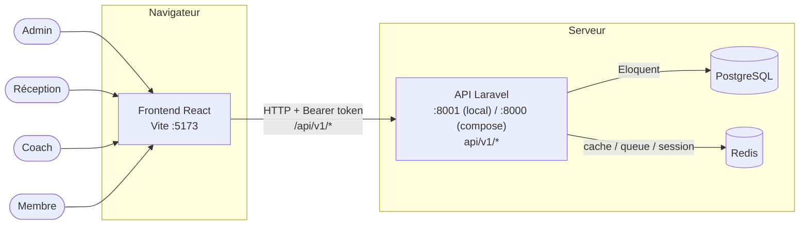

# Architecture — Kram Team Fitness Management

Document technique de compréhension du projet.
Mission 1 de la Phase 1 (« Comprendre le projet »).

## 1. Vue d'ensemble

Kram Team Fitness Management est une application de gestion de salle de sport (kickboxing, MMA, fitness) : CRM adhérents, abonnements, planning, réservations, check-in QR, paiements, notifications, Green Rewards, dashboards multi-rôles.

Cible à terme : plateforme **SaaS multi-tenant**, où une même plateforme sert plusieurs salles/espaces clients (voir `SAAS_TENANT_DESIGN.md`, mission 4). Aujourd'hui, le code ne porte pas encore cette notion : une seule salle est gérée.

## 2. Stack technique

| Couche | Technologie |
|---|---|
| Backend | Laravel 12, PHP 8.3+, API REST, Laravel Sanctum |
| Frontend | React 19, TypeScript, Vite, Tailwind CSS |
| Base de données | PostgreSQL (cible), MySQL/SQLite possibles en local |
| Cache / files d'attente | Redis + queues Laravel (progressivement activés) |
| Authentification | Sanctum, jeton Bearer stocké côté navigateur |

## 3. Schéma d'architecture

## 4. Rôles

Définis dans `App\Modules\Core\Enums\UserRole` :

| Rôle (code) | Libellé | Usage principal |
|---|---|---|
| `admin` | Administrateur | Accès complet : membres, offres, abonnements, staff, dashboard global |
| `reception` | Gestionnaire | Gestion adhérents, check-in, paiements, planning |
| `coach` | Coach | Consultation membres assignés, cours, rapports |
| `member` | Adhérent | Espace personnel : réservations, abonnement, Green Rewards |

Le contrôle d'accès est fait par un middleware (`EnsureUserHasRole`), appliqué sur les routes qui en ont besoin. Une route peut autoriser plusieurs rôles à la fois (ex. `admin, reception, coach` sur les membres).

Dans le vocabulaire SaaS de la mission de stage, deux rôles supplémentaires sont prévus mais pas encore présents dans le code : **Super Admin** (plateforme) et **propriétaire de salle**. Voir `SAAS_TENANT_DESIGN.md`.

## 5. Modules backend (`backend/app/Modules/`)

| Module | Rôle |
|---|---|
| `Authentication` | Login, register, déconnexion, jeton Sanctum |
| `Users` | Utilisateurs, rôles, permissions (RBAC), journal d'activité |
| `Core` | Enums, traits, middleware de rôle, contrôleur API de base |
| `Members` | Fiches adhérents, QR UUID |
| `Offers` | Offres et abonnements proposés, quotas |
| `Subscriptions` | Abonnements des membres (statuts, quotas) |
| `Quotas` | Consommation et historique des quotas (séances, heures) |
| `Attendance` | Présences, check-in/out QR |
| `QRSystem` | Génération et vérification des QR codes |
| `Schedule` | Cours, salles, créneaux de planning |
| `Booking` | Réservations (avec liste d'attente) |
| `Payments` | Paiements, remboursements, statuts |
| `Notifications` | Notifications in-app et mail, déclenchées par événements |
| `GreenRewards` | Actions éco, points, niveaux, boutique de récompenses |
| `HealthTracking` | Suivi santé (IMC, poids, objectifs) |
| `Dashboard` | Tableaux de bord par rôle |
| `Reports` | Rapports coachs (séances, heures, personnes entraînées) |

Chaque module suit la même structure : `Models/`, `Services/`, `Http/Controllers/`, `Http/Requests/`, `Http/Resources/`, `Policies/` (si besoin), `routes/api.php`, `Database/Migrations/`.

## 6. Flux d'une requête

1. Le frontend appelle `/api/v1/...` (préfixe ajouté automatiquement par `ModuleServiceProvider`, qui charge le fichier `routes/api.php` de chaque module).
2. Sanctum vérifie le jeton Bearer envoyé dans l'en-tête `Authorization`.
3. Le middleware `EnsureUserHasRole` vérifie que l'utilisateur a un rôle autorisé pour cette route.
4. Le contrôleur du module valide la requête (`Http/Requests`), appelle le service métier (`Services/`), qui lit/écrit en base via les modèles Eloquent.
5. La réponse est formatée par une `Resource` (JSON), renvoyée au frontend.
6. Certaines actions déclenchent des événements (`Notifications/Events/*`), écoutés pour créer des notifications in-app et/ou des mails.

## 7. Parcours par rôle (résumé)

- **Admin** : vue d'ensemble (dashboard admin), gestion des membres, offres, abonnements, staff, rapports.
- **Réception** : gestion des adhérents au quotidien, check-in QR, paiements, planning.
- **Coach** : consultation de ses cours et de ses membres, rapports de séances (heures, personnes entraînées).
- **Membre** : réservation de créneaux, suivi de son abonnement et de ses quotas, suivi santé, Green Rewards.

## 8. Dépendances et prérequis

Voir `docs/stage/LOCAL_SETUP.md` pour le détail testé : PHP 8.3, Composer 2, Node 20.19+/22.12+, Docker Desktop, ports 8001 (API), 5173 (front), 5432 (PostgreSQL), 6379 (Redis).

## 9. Ce qui n'existe pas encore

- Multi-tenant : aucun `tenant_id` ni modèle d'isolement dans le code actuel (voir mission 4).
- Rôles Super Admin / propriétaire de salle.
- Conteneurisation complète (seuls PostgreSQL et Redis sont en Docker à ce stade).
